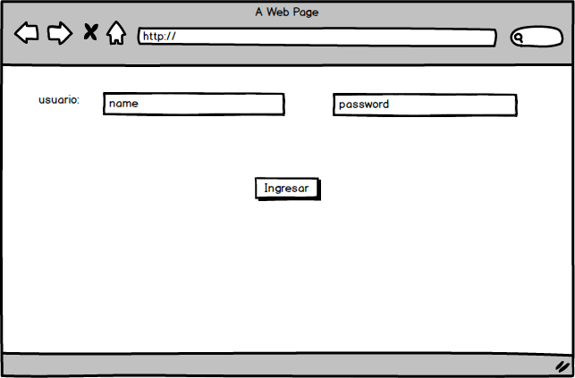
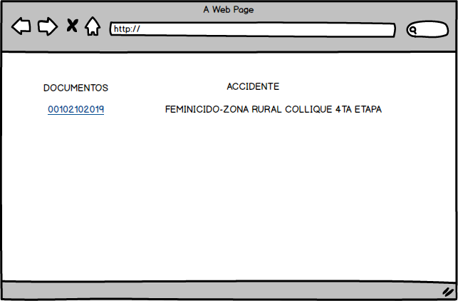
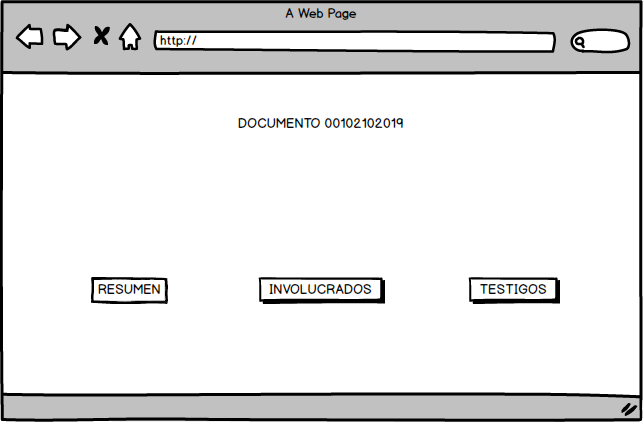

**`README.md`**:

Debe contener lo siguiente:

* Un título con el nombre de tu proyecto.
* Un resumen de 1 o 2 líneas de qué se trata tu proyecto.
* La imagen final de tu proyecto.
* Investigación UX:
  1. Explicar quiénes son los usuarios y los objetivos en relación con el
    producto.
  2. Explicar cómo el producto soluciona los problemas/necesidades de dichos
    usuarios.
  3. Luego colocarás la foto de tu primer prototipo en papel.
  4. Agregar un resumen del feedback recibido indicando las mejoras a realizar.
  5. Imagen del prototipo final

## Título: CONFIDENCIAL

Confidencial, se trata acerca del cifrado que se realiza para proteger a los testigos acerca de un crimen, y no sean dibulgados, que solo el personal policial haga las entrevistas lo cifren y lo decifren solo el area de investigación.

## IMAGENES

## INVESTIGACIÓN UX:

  1. Los usuarios son las personas que presencian un crimen y no quieren ser reconocidas.
  2. Ya que las personas antes mencionadas, tienen que si o si registrarse para que el area de investigación lo analizar
    mejor, para descrubir al criminal, lo hace ante un policia del area de denuncias y muchas veces esta información del testigo es devilguda y el criminal se entera de ello por ello ocurren mas homicidios.
  3. Conficial, otorga la seguridad de la persona, ya que el policia que los registra los cifra y ya no lo vuelven a ver    y los unicos que lo pueden decifrar son el área de investigación.
  4. Prototipo

  5. 
  6. Imagen final

## Objetivos de aprendizaje Cipher
​
A continuación te presentamos los objetivos de aprendizaje de este proyecto. Reflexiona y luego marca los objetivos que has llegado a **entender** y **aplicar** en tu proyecto.
​
### UX
​
- [] Diseñar la aplicación pensando y entendiendo al usuario.
- [x] Crear prototipos para obtener feedback e iterar.
- [x] Aplicar los principios de diseño visual (contraste, alineación, jerarquía).
​
### HTML y CSS
​
- [] Uso correcto de HTML semántico.
- [] Uso de selectores de CSS.
- [x] Construir tu aplicación respetando el diseño realizado (maquetación).
​
### DOM
​
- [] Uso de selectores del DOM.
- [x] Manejo de eventos del DOM.
- [] Manipulación dinámica del DOM.
​
### Javascript
​
- [x] Manipulación de strings.
- [x] Uso de condicionales (if-else | switch).
- [x] Uso de bucles (for | do-while).	
- [] Uso de funciones (parámetros | argumentos | valor de retorno).
- [] Declaración correcta de variables (const & let).
​
### Testing
- [] Testeo de tus funciones.
​
### Git y GitHub
- [x] Comandos de git (add | commit | pull | status | push).
- [ ] Manejo de repositorios de GitHub (clone | fork | gh-pages).
​
### Buenas prácticas de desarrollo
- [ ] Uso de identificadores descriptivos (Nomenclatura | Semántica).
- [ ] Uso de linter para seguir buenas prácticas (ESLINT).